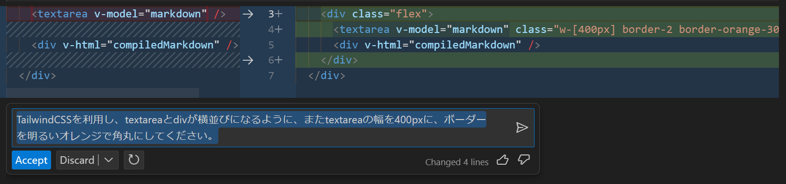

# GitHub Copilot Chatセルフペースドハンズオン

GitHub Copilot Chatを知るためのハンズオンです。

現行のGitHub Copilot（code completion）とは異なりチャット形式でAIのパワーを享受できるGitHub Copilot Chatについて、操作のポイントと、シナリオベースのハンズオンを掲載します。

後半のシナリオベースのハンズオンは、GitHub Copilot Chatの特性上、手順に従えば完成までたどり着けるというものではありませんが、実際の作業を想定した流れを再現しています。シナリオを参考に、GitHub Copilot Chatの扱い方の感覚を模索してみてください。

- [GitHub Copilot Chat基本操作](#GitHub-Copilot-Chat基本操作)
- [シナリオベースのハンズオン](#シナリオベースのハンズオン)

## GitHub Copilot Chat基本操作

はじめに、GitHub Copilot Chatの基本についてご紹介します。

まず、GitHub Copilot Chatはを利用するには、Visual Studio CodeまたはVisual Studioに拡張機能をインストールします。

| エディタ | 拡張機能 |
|----|----|
| Visual Studio Code | [GitHub Copilot Chat - Visual Studio Marketplace](https://marketplace.visualstudio.com/items?itemName=GitHub.copilot-chat) |
| Visual Studio | [GitHub Copilot Chat - Visual Studio Marketplace](https://marketplace.visualstudio.com/items?itemName=VisualStudioExptTeam.VSGitHubCopilot) |

ここでは、Visual Studio Code（以降、VS Code）にフォーカスして解説します。

VS CodeでGitHub Copilot Chatを操作するには、以下の3通りの方法があります。

- サイドバー（`Ctrl + Alt + i`）
- インライン（`Ctrl + i`）
- クイックチャット（`Ctrl + Shift + i`）

### サイドバー

左のGitHub Copilot Chatのアイコンを選択すると開く画面です。おそらく、GitHub Copilot Chatを使うときにメインで使う画面になるでしょう。

このUIから、開発に関する疑問を自然言語で質問できます。日本語でも大丈夫です。


たとえば、このような質問をしてみましょう。

```
Visual Studio CodeでTypeScriptのシンタックスハイライトを表示するにはどうすればよいですか？
```


すると、以下のように回答してくれます。この回答は、利用者や、その利用状況やときによって変わります。


ちなみに、以下のような開発以外の質問には答えてくれません。

```
東京の美味しいラーメン屋さんを教えて下さい
```

GitHub Copilot Chatは、エディタで開いているファイルや選択している部分を認識します。


回答の中で、コードやbashなどのコマンドを提示してくれることも多いです。コードブロックにカーソルを乗せるすると表示されるメニューから、エディタのカーソル位置に挿入したり、ターミナルで実行したりすることができます。


| メニュー項目 | 説明 |
|----|----|
| Copy | コードをクリップボードにコピーする |
| Insert at Cursor | エディタのカーソル位置にコードを挿入する |
| Insert Into New File | 新しいファイルとしてコードを挿入する |
| Run in Terminal | ターミナルにコードを貼りつける |

GitHub Copilot Chatは会話の文脈を考慮して回答してくれます。会話の履歴を消去するには、図に示す画面上部の「Clear」ボタンを選択します。


会話には、自然言語の指示だけでなく、コマンドも使えます。入力欄に`/`を打ち込むと、利用できるコマンドが表示されます。


現時点（2023年10月）で利用できるコマンドは以下の通りです。

| コマンド | 説明 |
|----|----|
| `/help` | GitHub Copilot Chatの使い方を確認する |
| `/tests` | 選択したコードに対するユニットテストを生成する |
| `/simplify` | 選択したコードをシンプルにする |
| `/fix` | 選択したコードに含まれる問題の解決方法を提案する |
| `/explain` | 選択したコードがどう動作するかを説明する |
| `/extApi` | VS Code拡張機能の開発に関して質問する |
| `/vscode` | VS Codeに関して質問する |
| `/craeteNotebook` | 新しいJupyter Notebookを作成する |
| `/createWorkspace` | 新しいワークスペース（※）の土台となるコードを生成する（Node.jsやPythonなどを指定する） |
| `/clear` | 会話の履歴を削除する |

※　VS Codeのワークスペース機能を指します。詳しくは、VS Codeのドキュメントをご参照ください。

- [Workspaces in Visual Studio Code](https://code.visualstudio.com/docs/editor/workspaces)

### インライン

サイドバーだけでなく、エディタのカーソルの位置もしくは選択している部分に対して、インラインでGitHub Copilot Chatに質問することができます。採用する場合は「Accept」またはEnterキー押下、無視する場合は「Discard」またはフォーカスを外しEscキー押下で操作します。


差分の表示がわかりやすいため、コードに直接変更を加えたい場合はインラインでの利用がおすすめです。

インラインでGitHub Copilot Chatに問い合わせるには、ショートカット（`Ctrl + i`）を使うか、右クリックのメニューから「Copilot」→「Start Code Chat」を選択します。


「Fix this」を選択した場合は、インラインで`/fix`コマンドが実行されます。選ぶ項目によっては、サイドバーで会話が続けられるものもあります。


### クイックチャット

ショートカット（`Ctrl + Shift + i`）を使うと、コマンドパレットのようなUIでクイックチャットを利用できます。


インラインと異なり、クイックチャットでは会話を続けられます。なお、サイドバーでの会話とは独立したセッションのようです。


これらのようにさまざまな方法でGitHub Copilot Chatを利用できます。開発の作業に集中しながら、AIのサポートを受けより素早く作業を進められることでしょう。

## シナリオベースのハンズオン

それでは、基本的な操作を学んだところで、シナリオに沿ってGitHub Copilot Chatとサンプルアプリを作ってみましょう。

簡易的なMarkdownエディタを作ってみることにします。仕様は以下としましょう。

- Nuxt 3のプロジェクトを作成する
- Markdownで書いてプレビュー表示できるエディタを作る
- TailwindCSSを導入する
- プレビュー部に適当なスタイルがあたるように`@tailwindcss/typography`を導入する

TailwindCSSをはじめ多くのCSSフレームワークは、何も指定していない状態のスタイルをリセットすることでスタイルを統一しています。そうすると、Markdownのプレビューで`<h1>`や`<li>`などのHTML要素が付与されても見た目がフラットなままになってしまいます。そこで、`@tailwindcss/typography`というライブラリを導入し、既定のclassを指定した要素の配下の要素に適当なスタイルがあたるようにします。

なお、冒頭でも述べましたが、手順通りにいかないことも多いと思います。筆者もワークショップでリードする際に、手こずるかもしれません。そんな状況も含めて、GitHub Copilot Chatの特性を体感してみてください。

また、先ほどまで入力していた会話の履歴を削除しておいてください。その方が会話の精度が保たれると思われます。

### Nuxt 3のプロジェクトを作成する

まず、コードベースを作成しましょう。Nuxt 3のプロジェクトを作成する方法をGitHub Copilot Chat（以後、Copilot Chat）に聞いてみます。

```
Nuxt 3のプロジェクトを作るにはどうしたらいいですか？
```

ここで、`create-nuxt-app`について回答してきたら、それはNuxt 2の内容なので聞きなおしてください。

```
それはNuxt 2の内容です。Nuxt 3ではどうすればよいですか？
```

以下のような`nuxi`を使ったコマンドが回答されれば正解です。Nuxt 3のプロジェクトを作成するときは、`nuxi`を使います。（`npm install -g nuxi`として、`nuxi`をインストールさせてから`nuxi init`を実行させる場合もあります）

```bash
# Nuxt 3のプロジェクトをnuxt3-appというディレクトリの中に作成する
npx nuxi init nuxt3-app
```

回答に表示されたコードブロックの「Run in Terminal」か、コピー&ペーストしてプロジェクトを作成してください。`nuxi init`を実行すると、対話的にプロジェクトの設定を質問されるので以下のように答えてください。

- `✔ Which package manager would you like to use?`という質問には、`npm`を選択する
- `✔ Initialize git repository?`という質問には、`No`を選択する

プロジェクトの作成が完了したら、作成したディレクトリに移動して、開発サーバーを起動してみましょう。

```bash
# ディレクトリに移動する
cd nuxt3-app

# 開発サーバーを起動する
npm run dev
```

無事にNuxt 3の初期画面が表示されたら成功です。起動した開発サーバーは、`Ctrl + c`で停止できます。

### Markdownで書いてプレビュー表記できるエディタを作る

つぎに、Markdownでプレビュー表示できるエディタを実装しましょう。そのままCopilot Chatに聞いてみます。

```
作成したプロジェクトにMarkdownのプレビューができるエディタを実装するにはどうすればいいですか？
```

`@nuxtjs/markdown-it`を勧めてくることがありますが、複雑になるので使いません。条件を付けて聞きなおしましょう。

```
@nuxtjs/markdown-itを使わずに、Markdownのプレビューができるエディタを実装するにはどうすればいいですか？
```

`markdown-it`や`remarkable`が提示されればそれを参考に実装してみましょう。`markd`については、さっと実装できなさそうです。

実装は`pages/index.js`に書くように誘導されることが多いようです。

だいたい準備できたら開発サーバーを起動してみましょう。

```bash
npm run dev
```

もし、以下のようにルートが見つからないというエラーが表示される場合は、解決方法をCopilot Chatに聞いてみましょう。

```bash
[Vue Router warn]: No match found for location with path "/"
```

```
上記を実装して開発サーバーを起動すると、[Vue Router warn]: No match found for location with path "/"というエラーが発生しました。どう修正すればよいですか？
```

`pages/index.vue`がない溜めに発生していたエラーのようです。上記でエディタ用に作成したファイルを`pages/index.vue`に変更して、再度開発サーバーを起動してみましょう。

無事に起動しましたか？

Nuxt 3の初期のサンプルページが表示されるのみで、意図した結果にならないかと思います。この画面には、`Remove this welcome page by replacing <NuxtWelcome /> in app.vue  with your own code.`のように書かれ、`app.vue`を編集するように促されています。どうしたら`pages/index.vue`を表示できるか、これもGitHub Copilot Chatに聞いてみましょう。

```
app.vueからpages/index.vueをよびだすにはどうすればいいですか？
```

ここで、`<Nuxt />`を使うように回答してきたら、それはNuxt 2の内容なので聞きなおしてください。

```
それはNuxt 2の書き方です。Nuxt 3でpages/index.vueを呼び出す方法を教えて下さい。
```

もしくは、独自のコンポーネントを配置するよう回答してきたら、他の方法を聞いてみましょう。

```
もっと簡潔に書けませんか？
```

理想的な正解は、`<NuxtPage />`を使うことです。

またGitHub Copilot Chatの回答が頓珍漢かもしれませんが、一旦以下のように`app.vue`を書き換えて進みましょう。

```diff
  <template>
    <div>
-     <NuxtWelcome />
+     <NuxtPage />
    </div>
  </template>
```


しかし、ちょっと無骨すぎますね。

TailwindCSSを適用して、見た目をカスタマイズしやすいようにしましょう。以下のようにCopilot Chatに聞いてみます。

```
このNuxt 3のプロジェクトにTailwindCSSを適用するにはどうすればよいですか？
```

おそらく、下記のようにいくつかのパッケージをインストールすよう促されます。

```bash
npm install -D tailwindcss@latest postcss@latest autoprefixer@latest
```

そして、tailwindCSSの設定ファイルを生成します。おそらく`-p`オプションが指定されて、`postcss.config.js`が生成されますが、Nuxt 3では不要です。後の手順で解消しましょう。

```bash
npx tailwindcss init -p
```

`tailwind.config.js`と`postcss.config.js`の設定を促されるので、対応します。

また、プロジェクトにスタイルシートを適用するために、`styles/main.css`を作成し、下記を記述します。

```css
@import 'tailwindcss/base';
@import 'tailwindcss/components';
@import 'tailwindcss/utilities';
```

作成した`styles/main.css`を参照するように、`nuxt.config.js`を更新します。

```diff
  export default defineNuxtConfig({
    devtools: { enabled: true },
+   css: ['~/styles/main.css'],
    ...
  })
```

さて、tailwindCSSが適用できたかわかりやすいように、いくつか*class*を付与しておきましょう。エディタのを実装したコードには、おそらく下記のように`<textarea>`や`<div v-html>`で構成されていると思います。

```vue
<textarea ...></textarea>
<div v-html="..."></div>
```

この部分を選択し、インラインでCopilot Chatに指示してみましょう。見た目の変更を少し細かく指示してみます。

```
TailwindCSSを利用し、右記を満たしてください。マージンを10pxに指定する。textareaとdivが横並びになる。textareaの幅を400pxに、ボーダーを明るいオレンジで角丸にする。
```



開発サーバーを起動してみましょう。

前の手順で`postcss.config.js`を作成した場合、以下のような警告が表示され、TailwindCSSが適用されません。

```bash
WARN  Using postcss.config.js is not supported together with Nuxt. Use options.postcss instead. You can read more in https://nuxt.com/docs/api/configuration/nuxt-config#postcss.
```

まずは、この警告について、Copilot Chatに聞いてみましょう。`/fix`コマンドを使ってこの警告を渡します。

```
/fix WARN  Using postcss.config.js is not supported together with Nuxt. Use options.postcss instead. You can read more in https://nuxt.com/docs/api/configuration/nuxt-config#postcss.
```

`postcss.config.js`から`nuxt.config.js`に設定を移行するよう促されると思います。以下のような設定が正解です。`build`などの階層を示してくることが多いのですが、ここは諦めて以下の設定で進みましょう。

```js
export default defineNuxtConfig({
  devtools: { enabled: true },
  css: ['~/styles/main.css'],
  postcss: {
    plugins: {
      tailwindcss: {},
      autoprefixer: {},
    },
  },
})
```

開発サーバーを起動し直します。正しく設定できていれば、見た目の変更が反映されているはずです。

ただし、Markdownで`# 見出し`や`- 箇条書き`と記述しても、プレビューの`<h1>`や`<li>`などの装飾が表示されません。これは、TailwindCSSは明示的に*class*を指定していない場合はフラットな表示になるようにスタイルをリセットしているためです。

これを解消する方法をGitHub Copilot Chatに聞いてみましょう。

```
TailwindCSSで明示的にclassを指定しなくてもいい感じの装飾がされるようにする方法はありますか？
```

`@tailwindcs/typography`をお勧めされたと思います。これを導入してみましょう。

```
npm install @tailwindcss/typography
```

`tailwind.config.js`の`plugins`に`require('@tailwindcss/typography')`を追加します。

```diff
  module.exports = {
    theme: {
      // ...
    },
    plugins: [
+     require('@tailwindcss/typography'),
    ],
  }
```

そして、いい感じに装飾したいHTML要素に対して`prose`クラスを適用します。

```vue
<div v-html="..." class="prose"></div>
```

開発サーバーを起動して確認してみましょう。いい感じに装飾されたMarkdownエディタができあがりましたか？


まだ見た目がいまいちですし、なかなか思うように作れなかった方もいらっしゃるかもしれません。残りの時間は自由に触ってみてください！
