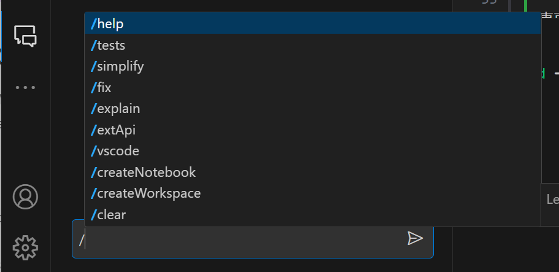

# GitHub Copilot Chatセルフペースドハンズオン

GitHub Copilot Chatを知るためのハンズオンです。

現行のGitHub Copilot（code completion）とは異なりチャット形式でAIのパワーを享受できるGitHub Copilot Chatについて、操作のポイントと、シナリオベースのハンズオンを掲載します。

後半のシナリオベースのハンズオンは、GitHub Copilot Chatの特性上、手順に従えば完成までたどり着けるというものではありませんが、実際の作業を想定した流れを再現しています。シナリオを参考に、GitHub Copilot Chatの扱い方の感覚を模索してみてください。

- [GitHub Copilot Chat基本操作](#GitHub-Copilot-Chat基本操作)
- [シナリオベースのハンズオン](#シナリオベースのハンズオン)

## GitHub Copilot Chat基本操作

はじめに、GitHub Copilot Chatの基本についてご紹介します。

まず、GitHub Copilot Chatはを利用するには、Visual Studio CodeまたはVisual Studioに拡張機能をインストールします。

| エディタ | 拡張機能 |
|----|----|
| Visual Studio Code | [GitHub Copilot Chat - Visual Studio Marketplace](https://marketplace.visualstudio.com/items?itemName=GitHub.copilot-chat) |
| Visual Studio | [GitHub Copilot Chat - Visual Studio Marketplace](https://marketplace.visualstudio.com/items?itemName=VisualStudioExptTeam.VSGitHubCopilot) |

ここでは、Visual Studio Code（以降、VS Code）にフォーカスして解説します。

VS CodeでGitHub Copilot Chatを操作するには、以下の3通りの方法があります。

- サイドバー（`Ctrl + Alt + i`）
- インライン（`Ctrl + i`）
- クイックチャット（`Ctrl + Shift + i`）

### サイドバー

左のGitHub Copilot Chatのアイコンを選択すると開く画面です。おそらく、GitHub Copilot Chatを使うときにメインで使う画面になるでしょう。

このUIから、開発に関する疑問を自然言語で質問できます。日本語でも大丈夫です。


たとえば、このような質問をしてみましょう。

```
Visual Studio CodeでTypeScriptのシンタックスハイライトを表示するにはどうすればよいですか？
```


すると、以下のように回答してくれます。この回答は、利用者や、その利用状況やときによって変わります。


ちなみに、開発以外の質問には答えてくれません。

```
東京の美味しいラーメン屋さんを教えて下さい
```

GitHub Copilot Chatは、開いているファイルや選択している部分を認識します。また、どうやら開いているディレクトリも認識しているようです。

回答の中で、コードやbashなどのコマンドを提示してくれることも多いです。コードブロックにカーソルを乗せるすると表示されるメニューから、エディタのカーソル位置に挿入したり、ターミナルで実行したりすることができます。


| メニュー項目 | 説明 |
|----|----|
| Copy | コードをクリップボードにコピーする |
| Insert at Cursor | エディタのカーソル位置にコードを挿入する |
| Insert Into New File | 新しいファイルとしてコードを挿入する |
| Run in Terminal | ターミナルにコードを貼りつける |

GitHub Copilot Chatは会話の文脈を考慮して回答してくれます。会話の履歴を消去するには、図に示す画面上部の「Clear」ボタンを選択します。


会話には、自然言語の指示だけでなく、コマンドも使えます。入力欄に`/`を打ち込むと、利用できるコマンドが表示されます。



現時点（2023年10月）で利用できるコマンドは以下の通りです。

| コマンド | 説明 |
|----|----|
| `/help` | GitHub Copilot Chatの使い方を確認する |
| `/tests` | 選択したコードに対するユニットテストを生成する |
| `/simplify` |  |
| `/fix` | |
| `/explain` | |
| `/extApi` | |
| `/vscode` | |
| `/craeteNotebook` | |
| `/createWorkspace` | |
| `/clear` | |

### クイックチャット

## シナリオベースのハンズオン

- Nuxt 3のプロジェクトを作成する
- Markdownで書いてプレビュー表記できるエディタを作る
- TailwindCSSを適用する
- プレビューのところに、`@tailwindcss/typography`を導入する

### Nuxt 3のプロジェクトを作成する

```
Nuxt 3のプロジェクトを作るにはどうしたらいいですか？
```

ここで、`create-nuxt-app`について回答してきたら、それはNuxt 2の内容なので聞きなおしてください。

```
それはNuxt 2の内容です。Nuxt 3ではどうすればよいですか？
```

Nuxt 3のプロジェクトを作成するときは、`nuxi`を使います。以下のようなコマンドの実行を促されていれば正解です。（`npm install -g nuxi`として、`nuxi`をインストールさせる場合もあります）

```bash
# Nuxt 3のプロジェクトをnuxt3-appというディレクトリの中に作成する
npx nuxt init nuxt3-app
```

ディレクトリに移動して、開発サーバーを起動してみましょう。

```bash
# ディレクトリに移動する
cd nuxt3-app

# 開発サーバーを起動する
npm run dev
```

### Markdownで書いてプレビュー表記できるエディタを作る

```
このプロジェクトにMarkdownのプレビューができるエディタを実装するにはどうすればいいですか？
```

`@nuxtjs/markdown-it`を勧めてくることがありますが、複雑になるので使いません。条件を付けて聞きなおしましょう。

```
@nuxtjs/markdown-itを使わずに、Markdownのプレビューができるエディタを実装するにはどうすればいいですか？
```

`pages/index.js`に書くように誘導されることが多いようです。

だいたい準備できたら開発サーバーを起動してみましょう。

```bash
npm run dev
```

すると、Nuxt 3の初期のサンプルページが表示されるのみで、意図した結果にならないかと思います。ここには、`Remove this welcome page by replacing <NuxtWelcome /> in app.vue  with your own code.`のように書かれ、`app.vue`を編集するように促されます。これもGitHub Copilot Chatに聞いてみましょう。

```
app.vueからpages/index.vueをよびだすにはどうすればいいですか？
```

ここで、`<Nuxt />`を使うように回答してきたら、それはNuxt 2の内容なので聞きなおしてください。

```
それはNuxt 2の書き方です。Nuxt 3でpages/index.vueを呼び出す方法を教えて下さい。
```

正解は、`<NuxtPage />`を使うことです。

`app.vue`の`<NuxtWelcome />`を`<NuxtPage />`書き換えると動作しましたね？


しかし、ちょっと無骨すぎますね。

TailwindCSSを適用して、見た目のカスタマイズがしやすいようにしましょう。

```
このNuxt 3のプロジェクトにTailwindCSSを適用するにはどうすればよいですか？
```

```
npm install -D tailwindcss@latest postcss@latest autoprefixer@latest
```

`-p`はNuxt 3で使わない`postcss.config.js`を生成してくれるのですが、不要です。（生成してしまっても使わないだけなので大丈夫です）

```
npx tailwindcss init
```

わかりやすいように、いくつか`class`を付与しておきましょう。エディタの実装は、おそらく下記のように`<textarea>`や`<div v-html>`で構成されていると思います。

```vue
<textarea ...></textarea>
<div v-html="..."></div>
```

この部分を選択し、インラインでCopilot Chatに見た目の変更を指示してみましょう。

```
TailwindCSSを利用し、textareaとdivが横並びになるように、またtextareaの幅を400pxに、ボーダーを明るいオレンジで角丸にしてください。
```

いったんそのまま進めると、以下のような警告が表示され、TailwindCSSが適用されていないことがわかるので、このエラーについて聞いてみましょう。

```bash
WARN  Using postcss.config.js is not supported together with Nuxt. Use options.postcss instead. You can read more in https://nuxt.com/docs/api/configuration/nuxt-config#postcss.
```

`/explain`の後ろに警告文を渡します。

```
/explain WARN  Using postcss.config.js is not supported together with Nuxt. Use options.postcss instead. You can read more in https://nuxt.com/docs/api/configuration/nuxt-config#postcss.
```

うまく回答を得られないときは、以下のように質問を変えてみるのも手かもしれません。

```
Nuxt 3のpostcssの設定について教えて
```

正しく設定できたら、見た目の変更が反映されているはずです。

ただし、Markdownで`# 見出し`や`- 箇条書き`と記述しても、プレビューの`<h1>`や`<li>`などの装飾が表示されません。これは、TailwindCSSは明示的に`class`を指定していない場合はフラットな表示になるように装飾をリセットしているためです。

これを解消する方法をGitHub Copilot Chatに聞いてみましょう。

```
TailwindCSSで明示的にclassを指定しなくてもいい感じの装飾がされるようにする方法はありますか？
```

`@tailwindcs/typography`をお勧めされたと思います。これを導入してみましょう。

```
npm install @tailwindcss/typography
```

`tailwind.config.js`の`plugins`に`require('@tailwindcss/typography')`を追加します。

```js
module.exports = {
  theme: {
    // ...
  },
  plugins: [
    // ↓ここから
    require('@tailwindcss/typography'),
    // ↑ここまでを反映する
    // ...
  ],
}
```

そして、いい感じに装飾したいHTML要素に対して`prose`クラスを適用します。

```vue
<div v-html="..." class="prose"></div>
```
