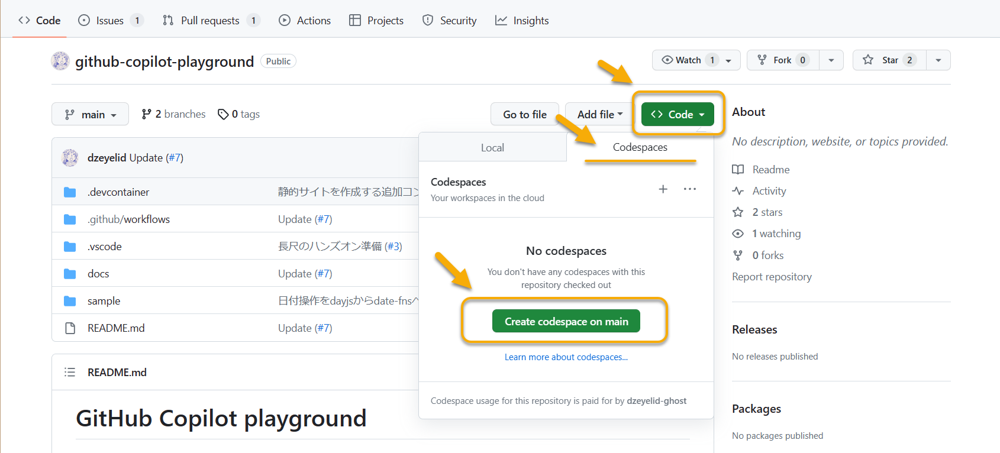
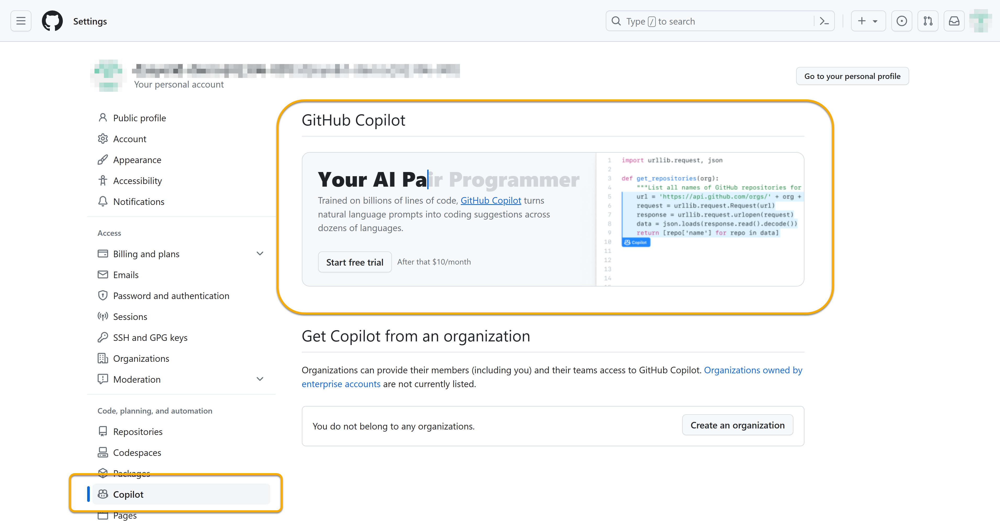
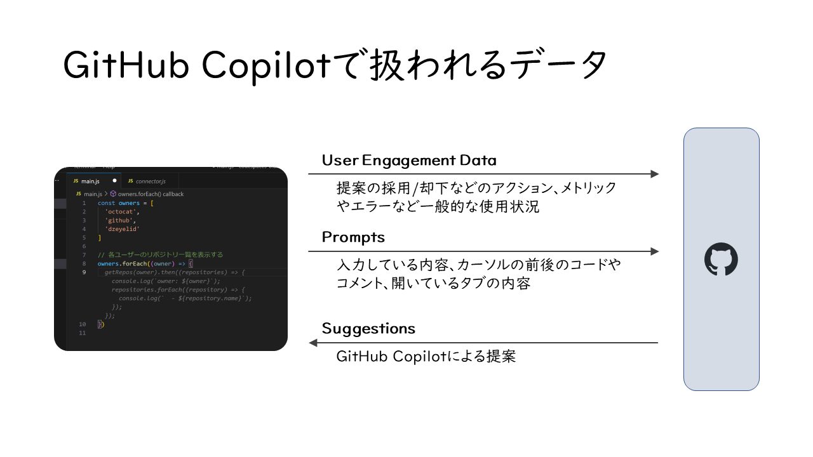
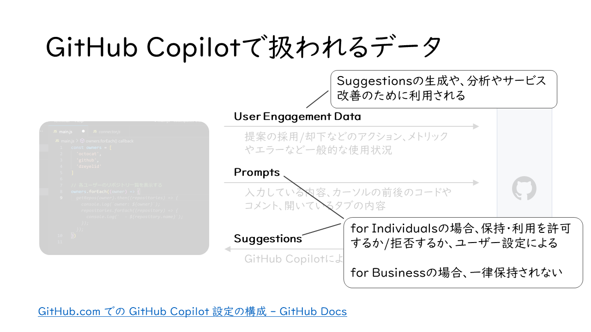
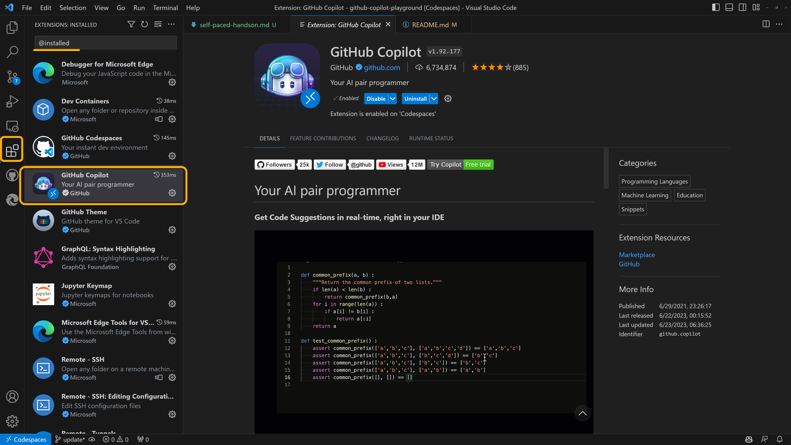
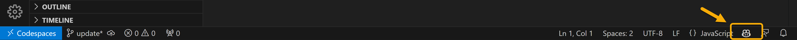

# セルフペースド ハンズオン資料

このドキュメントは、以下のイベントで使用する資料です。

- [GitHub Copilotとの強力なタッグをいち早く取り入れるハンズオン](https://microsoft-events.connpass.com/event/286473/)
- [【オフライン30名限定】GitHub Copilotと一緒に静的サイトCI/CDを作ってみる（ハンズオンワークショップ） – MICUG（マイカグ）](https://micug.jp/event/%e3%80%90%e3%82%aa%e3%83%95%e3%83%a9%e3%82%a4%e3%83%b330%e5%90%8d%e9%99%90%e5%ae%9a%e3%80%91github-copilot%e3%81%a8%e4%b8%80%e7%b7%92%e3%81%ab%e9%9d%99%e7%9a%84%e3%82%b5%e3%82%a4%e3%83%88ci-cd/)

今注目のGitHub Copilotを、実際にどのように動くか手を動かして体験することで、仕組みとコツを体得するためのハンズオンです。

## ハンズオンを進めるための準備

### ライセンスの準備

ライセンスをすでにお持ちの方はそのままお進みいただけます。

ライセンスをお持ちでない方は、スタッフが用意した「GitHub Copilot for Business」を適用できるOrganizationに招待するので、下記のissueにコメントする形で、GitHubアカウントをスタッフにお伝えください。

- [GitHub Copilotライセンス付与リクエスト用issue](https://github.com/handson-202306/handson-20230703/issues/1) ※2023/07/03のみ

Organizationに招待されるとメールで通知が届くので、文面に従い必ず承諾してください。承諾が済んだ後、しばらくするとGitHub Copilotのアクセスが有効になります。

### （追加コンテンツを行う場合）リポジトリのフォーク

[追加コンテンツ](./deploy-chart.md)も実施する場合は、リポジトリへのプッシュが必要になるので、フォークしてから作業を進めます。

次に作業するGitHub Codespacesの立上げは、フォークした先のリポジトリから行ってください。

### 環境の準備

GitHub Codespacesで体験いただく予定です。

下記の手順で立ち上がるcodespaceの環境は、GitHub Copilotの拡張機能がインストールされています。

もしくは、ご自身でご用意できるようでしたら、サポートされる環境をお手元で整えていただいても構いません。このリポジトリをクローンする必要はなく、GitHub Copilotの拡張機能がインストールされていればOKです。

サポートされる環境の解説は、[後述](#サポートされる環境)にて解説します。

#### フォークせず利用する場合

下記の「Open in GitHub Codespaces」ボタンを選択すると、このリポジトリをベースにcodespaceの環境が立ち上がります。（※ 前述でGitHub Copilotのライセンスを確認したGitHubアカウントでサインインした状態で進めてください。）

[](https://codespaces.new/dzeyelid/github-copilot-playground?quickstart=1)

#### フォークして利用する場合

フォークしたリポジトリで、下図のようにGitHub Codespacesを起動します。（※ 前述でGitHub Copilotのライセンスを確認したGitHubアカウントでサインインした状態で進めてください。）



## 座学

### GitHub Copilotとは

GitHub Copilotは、GPTモデルを利用した「**開発に特化したAIによる入力補完**」です。

ベースに利用されている[Codex](https://openai.com/blog/openai-codex)は開発用に調整されたモデルであり、他のGPTモデルに比べて開発作業を邪魔しない速度で応答できる速さが特徴です。

### ライセンスについて

GitHub Copilotは、個人向けに「for Individuals」を、業務利用向けに「for Business」のライセンスを提供しています。

自身のライセンスの状況は、GitHubのアカウントのSettingsから確認できます。


まだどちらのライセンスも適用されていない場合はこのように「Free trial」への案内が表示されます。



「for Business」の場合は、このように設定がオーバーライドされる形で適用されます。


各ライセンスの詳細は、以下のドキュメントをご参照ください。

- [GitHub Copilot for Individuals について - GitHub Docs](https://docs.github.com/ja/copilot/overview-of-github-copilot/about-github-copilot-for-individuals)
- [GitHub Copilot for Business について - GitHub Docs](https://docs.github.com/ja/copilot/overview-of-github-copilot/about-github-copilot-for-business)

### データの扱いと設定

GitHub Copilotを利用するにあたり、いくつかのデータの送受信が行われます。

| GitHub Copilotで扱われるデータの種類 | 説明 |
|----|----|
| **User Engagement Data** | 提案の採用/却下などのアクション、メトリックやエラーなど一般的な使用状況 |
| **Prompts** | 入力している内容、カーソルの前後のコードやコメント、開いているタブの内容 |
| Suggestions | GitHub Copilotによる提案 |

このうち、「コードやドキュメントのデータ」に関して、「学習に使われたり予期せぬ場所の保存されたりしないか」を心配される声をよくお聞きします。これは、**Prompts**に該当し、Promptsの扱いについては利用者が制御できます。

「for Business」の場合は、Promptsを一切保持しません。GitHubに渡されたPromptsは、提案の生成が終わったらすぐに破棄されます。

また、「for Indivisuals」の場合は、設定の「Allow GitHub to use my code snippets for product improvements」にて許可または拒否を選択できます。





### サポートされる環境

GitHub Copilotは、ライセンスだけあっても使えません。実際に利用するには、サポートされるエディタまたはIDEに「**拡張機能**」を導入する必要があります。

サポートされるエディタ/IDEは以下の通りです。

- Visual Studio Code
- Visual Studio
- Vim/Neovim
- JetBrains IDEs (beta)

Visual Studio Codeの場合はこの拡張機能を利用します。

- [GitHub Copilot - Visual Studio Marketplace](https://marketplace.visualstudio.com/items?itemName=GitHub.copilot)



また、コードを書いている間は、右下にGitHub Copilotのアイコンが表示されていることを確認してください。提案を返そうとする間は回転するマークの表示になります。なお、アイコンの背景が暗い黄色の場合はDeactive（無効）になっているので、クリックしてActive（有効）にしてください。



詳しくは、以下のドキュメントをご参照ください。

- [GitHub Copilot の概要 - GitHub Docs](https://docs.github.com/ja/copilot/getting-started-with-github-copilot)

## 手を動かしてみる！

GitHub Copilotに指示すること=Prompts（プロンプト）は、コードやコメントをエディタに入力することで行われます。プロンプトでは、以下の「3つのS」を意識すると、GitHub Copilotと上手にコミュニケーションを取れるようになると言われています。

- Single
- Specific
- Short

ここからは、実際に手を動かして、GitHub Copilotと仲良くなりましょう！

まず、[凝縮版](./short.md)の「[ゼロから書き出してみる](./short.md#ゼロから書き出してみる)」を参照し、基本の操作を確認しましょう。

また、以下のポイントも確認しておきます。（これは、後続の章で手を動かしながら解説します）

- [タブで開いたファイルもコンテキストに含まれる](./short.md#タブで開いたファイルもコンテキストに含まれる)
- [編集中のファイルパスや言語が優先される](./short.md#編集中のファイルパスや言語が優先される)

## もっと複雑なコードに挑戦してみる

もう少し複雑なコードに挑戦してみましょう。JavaScriptで描画を行える`p5.js`を利用して、オセロゲームを作ってみます。

### 作業ディレクトリを確認する

`sample/game`ディレクトリにあるファイルを使って、オセロゲームを作っていきます。

```bash
├── index.html      # ゲームを描画するHTMLファイル
├── logic.js        # ゲームロジックを記述したJavaScriptファイル
├── references      # リファレンス（詰まったとき用）
│   ├── example.js  
│   └── index.html
└── sketch.js       # ゲームの描画処理を記述するJavaScriptファイル
```

### HTMLを準備する

以下のように書き出してみましょう。

```html
<!-- p5.jsを利用してオセロゲームを描画する -->
<!DOCTYPE html>
```

そのままHTMLを書き進めると、`p5.js`のライブラリを読み込む記述が提案されるかもしれません。ただし、バージョンが古いことがあるのでよく確認してください。今は`1.6.0`が最新です。

公式ドキュメントを参考に、取得するCDNを指定するとちょうどよい候補が出るかもしれません。

- [get started | p5.js](https://p5js.org/get-started/#settingUp)

```html
<!-- p5.jsのライブラリをjsdelivrから読み込む -->
```

もしくは、提案に頼らず下記を記述しても構いません。（無理やりGitHub Copilotに書かせるより、これまで通りドキュメントから引用した方が早いならその方がよいですよね）

```html
<script src="https://cdn.jsdelivr.net/npm/p5@1.6.0/lib/p5.js"></script>
```

また、以下の2つのJavaScriptファイルも読み込んでおいてください。

- `logic.js`
- `sketch.js`

ここまでで、最低限、下記の要素が記述できればOKです。

```html
<html>
  <head>
    <script src="https://cdn.jsdelivr.net/npm/p5@1.6.0/lib/p5.js"></script>
    <script src="logic.js"></script>
    <script src="sketch.js"></script>
  </head>
  <body>
    <main>
    </main>
  </body>
</html>
```

`p5.js`の導入については、詳しくはこちらをご参考ください。

- [get started | p5.js](https://p5js.org/get-started/#settingUp)

### 描画処理を記述する

さて、描画処理を記述していきます。`sketch.js`に以下を転記します。（コピー＆ペーストでOKです）

```js
// p5.jsによる描画を行う
// オセロの盤面を描画する
// 縦5マス、横5マス
// 盤面の状況を元に、石を描画する
// 盤面は500x500の正方形
// 盤面の各マスにはアルファベットが割り振られている
// 左上がaで始まり横向きに順番に割り振られている
// 盤面の各マスの中央にアルファベットを振る
// アルファベットが入力されたらその位置に石を置く

function setup() {
}

function draw() {
}

function keyPressed() {
}
```

上記には、これから作成するゲームの仕様をコメントで記述しています。また、`setup()`、`draw()`、`keyPressed()`の関数は`p5.js`の仕様に従ったもので、p5.jsによって自動的に呼び出されます。

なお、実は`logic.js`に参考になる実装が記述されていますが、ここではそれを開かない状態で進めてください。

それでは、それぞれの関数の中を記述していきましょうか。

```js
function setup() {
  ← 改行して書き出してみる
}
```

書き進められそうですか？ちょっと時間がかかりそうですね。

それでは、GitHub Copilotにより多くのコンテキストを与えるために、ゲームのロジックを記述した`logic.js`をタブで開いてあげましょう。少し書きやすくなりましたか？

その状態で再度それぞれの関数の中を記述し、オセロで遊べるように作り上げましょう！😎

そのまま`logic.js`を利用してもよいですし、新しくロジック部分を記述し直しても構いません。

もし詰まってしまったら、`references/example.js`を参考にしてみてください。タブで開くと、GitHub Copilotが読み込んで完全なチートになってしまうかもしれないので、開いたら閉じるか、ブラウザの方でひらくとよいでしょう。

また、ここで用意したリファレンスは最低限の動作しかしません。時間の許す限り、GitHub Copilotと協力してゲームのクオリティを突き詰めるのも一興です🧙🏻
