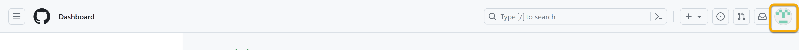
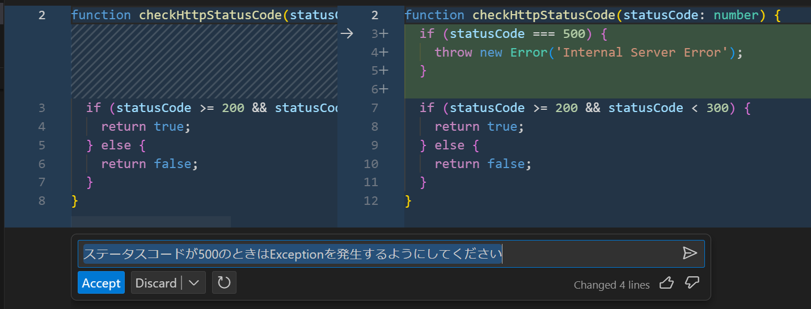
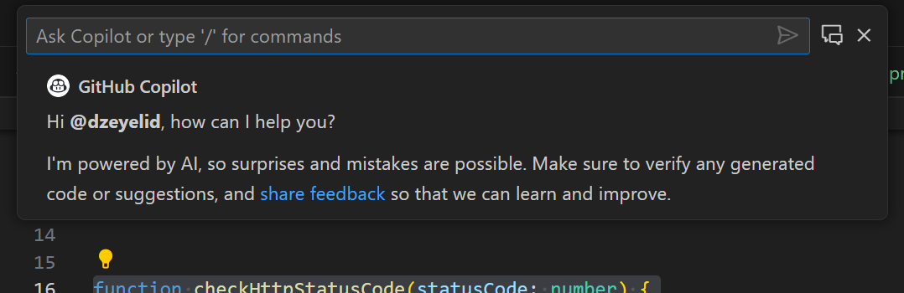
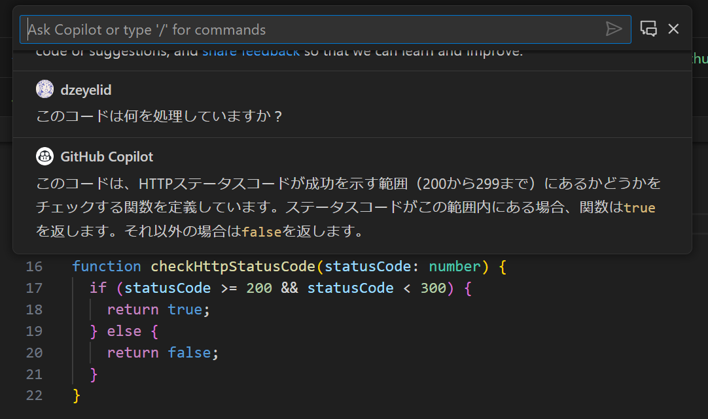

# GitHub Copilotセルフペースドハンズオン - クイックキャッチアップ

## はじめに

本ハンズオンでは、GitHub Copilotの概要をご紹介してから、GitHub Copilot(code completion)やGitHub Copilot Chatについてポイントをご紹介します。

## GitHub Copilotとは

GitHub Copilotは、GitHubが開発した開発に特化したAIアシスタントです。コード補完や生成、解説を行うことができます。始めはコード補完のみでしたが、今ではチャットやCLI上など、さまざまなシーンでAIの支援を活用できるようになってきています。

### 機能

| 機能 | リリース状況 | 説明 |
|----|----|----|
| **GitHub Copilot(Code completion)** | GA | AIによるコード補完。IDEの拡張機能として提供される。LLMモデルはGPT-3.5 Turbo（※1）。 |
| **GitHub Copilot Chat** | Public beta, 12月GA予定 | IDEまたはモバイルアプリ（※2）上で、会話形式でAIによるコード生成、解説を支援する。LLMモデルはGPT-4（※3）。 |
| **Copilot in the CLI** | Public beta | AIによるコマンド生成支援 |
| GitHub Copilot Chat in GitHub.com | GitHub Enterpriseに内包予定 | GitHub.com上でGitHub Copilot Chatを利用できる。指定したリポジトリをコンテキストに含められる。 |
| GitHub Copilot pull request summaries | GitHub Enterpriseに内包予定 |  |

- ※1 2023年6月の情報。
  - 参考: [GitHub Copilot - June 29th Update - The GitHub Blog](https://github.blog/changelog/2023-06-29-copilot-june-2023-update/#code-completion-improvements)
    > GitHub Copilot is now even more powerful and responsive for developers, thanks to a new model powered by GPT-3.5 Turbo through the collaboration across OpenAI, Azure AI, and GitHub that offers 13% latency improvements.
- ※2 GitHubのモバイルアプリで提供される予定。
- ※3 GitHub Universe 2023で、GitHub Copilot ChatはGPT-4ベースだと公表されている。
  - 参考: [Universe 2023: Copilot transforms GitHub into the AI-powered developer platform - The GitHub Blog](https://github.blog/2023-11-08-universe-2023-copilot-transforms-github-into-the-ai-powered-developer-platform/)

### 料金体系

| プラン | 説明 |
|----|----|
| **GitHub Copilot Individual** | 個人利用向けプラン。データの収集の可否を選択できる。 |
| **GitHub Copilot Business** | Organization単位、Enterprise単位での利用。Individualと異なり、データの収集は一律行わない。Individualより優先される。 |
| GitHub Copilot Enterprise | 最近発表されたプラン。Organization単位、Enterprise単位での利用。後述。 |

#### GitHub Copilot Enterpriseについて
GitHub Copilot Enterpriseは、GitHub Universe 2023で発表されました。GitHub Copilot Businessの機能に加え、以下のような組織の資産を注入できる機能が含まれるようです。GA前に試用するには、waitlistの申請が開始されています。

- Copilot Chat in GitHub.com
- Documentation search and summaries
- Copilot pull request summaries
- Code review skills
- Fine-tuned models（現在はプレビュー。2024に利用可能予定。）

詳しくは下記サービスサイトやドキュメントをご参照ください。

- 参考: [About GitHub Copilot Enterprise - GitHub Docs](https://docs.github.com/ja/copilot/github-copilot-enterprise/overview/about-github-copilot-enterprise)
- 参考: [Pricing - GitHub Copilot · Your AI pair programmer](https://github.com/features/copilot#pricing)

## ハンズオン環境の確認

まず、GitHub Copilot(code completion,chat)を利用するために必要な環境を確認します。本ハンズオンでは既に設定済みです。

### GitHub Copilotのライセンスを確認する

GitHub Copilotを利用するにはまず、個人向けは「Individuals」の契約を、業務向けには「Business」のライセンスを割り当てる必要があります。　

本ハンズオンでは、端末でサインイン済みの各アカウントに対して「Business」のライセンスを割り当てており、GitHubアカウントの設定から確認することができます。




### IDEの拡張機能を確認する

本ハンズオンでは、IDE上におけるGitHub Copilot(code completion)やGitHub Copilot Chatの機能を体験いただきます。サポートされるIDEは下記の通りです。

| 機能 | サポートされるIDE |
|----|----|
| GitHub Copilot(code completion) | Visual Studio Code, Visual Studio, JetBrains IDEs, Vim/Neovim, Azure Data Studio |
| GitHub Copilot Chat | Visual Studio Code, Visual Studio, JetBrains IDEs(Private beta) |

このハンズオンでは、Visual Studio Code(VS Code)を利用します。GitHub Copilot(code completion)およびGitHub Copilot Chatは、IDEに拡張機能をインストールすることで利用できます。（冒頭の指示によりGitHub Codespacesで立ち上げた環境には、既にインストール済みです）

- [GitHub Copilot - Visual Studio Marketplace](https://marketplace.visualstudio.com/items?itemName=GitHub.copilot)
- [GitHub Copilot Chat - Visual Studio Marketplace](https://marketplace.visualstudio.com/items?itemName=GitHub.copilot-chat)

## GitHub Copilot(code completion)

GitHub Copilot(code completion)は、カーソル位置に、AIによるコード補完の候補を提案してくれる機能です。

試しに、`sample/nodejs/main.js`を開き、コードを書き始めてみましょう。以下のコードを、コピー＆ペーストではなく、入力してみてください。

```js
// 四則演算を行う

const add
```

ちょうど書き終わるころ、下図のように`const add`の後ろに候補が表示されるのがわかりますか？


これがGitHub Copilotによる候補です。確定するには、「Tab」キーを入力してください。候補を無視するには、そのまま書き続けるか、`Esc`キーでクリアできます。

候補を生成して返却されるまでの間、エディタ右下のGitHub Copilotのアイコンが回転する表示になります。このアイコンの背景が暗い黄色の場合は、GitHub CopilotがDeactive（無効）になっているので、クリックしてActive（有効）に切替えてください。


候補はいくつか提示されることがあります。候補のグレーの文字列にカーソルを乗せると表示されるウィンドウを利用するか、キーバインドで切替えることができます。


| OS | 	次の候補を表示 | 前の候補を表示 |
|----|----|----|
| Windows, Linux | `Alt` + `]` | `Alt` + `[` |
| macOS | `Option` + `]` | `Option` + `[` |

さて、AIによる候補を得るには、LLMにコンテキストを渡します。GitHub Copilot(code complition)では、以下の箇所がコンテキストとして渡されます。ただし、コンテキストを渡すためのトークンにはサイズの制限があるため、優先順位が高いものから順に渡されます。

- カーソルの**前後**のコードやコメント
- **編集中のファイル全体**
- タブで開いているファイル（**同じ拡張子が優先**される）

会話型のAIと異なる特徴として、前後の文脈を含められることが挙げられます。これは、FIM（Fill-in-the-Middle）という手法が採用されています。

より候補の精度を上げるには、コメントや関数や変数の命名が重要です。

コメントのコツは、3つのSです。要件や説明を長々書くよりも、簡潔に、具体的に、短く書くと候補に反映されやすいです。また、ファイルの先頭に、そのファイルで行う処理についてひとまとめに書いておくことも有効です。

- Single - 簡潔に
- Specific - 具体的に
- Short - 短く

### 演習

`sample/nodejs/main.js`でもう少し試してみましょう。

1. 候補をうまく利用しながら、四則演算を行う関数を完成させてください。
   ```js
   // 四則演算を行う

   const add = (a, b) => a + b;
   const sub = (a, b) => a - b;
   const mul = (a, b) => a * b;
   const div = (a, b) => a / b;
   ```
2. `mul`や`div`の関数名を省略しない形に書換え、`sub`も書きなおそうとしてみてください。（カーソルの後方もコンテキストに含められることを確認）
   ```js
   // 四則演算を行う
   
   const add = (a, b) => a + b;
   const sub = (a, b) => a - b;
   const multiply = (a, b) => a * b;
   const divide = (a, b) => a / b;
   ```
   `sub`に対して`subtract`の候補が提示されるでしょう。
   
3. 各行にコメントを記述してみましょう。書き進むにつれ、適切な候補が提案されるので、速く書けますね。
   

演習では割愛しますが、編集中のファイルとは別に、同じ拡張子のファイルをタブで開くと、その内容も加味して候補を提案してくれるようになります。ぜひ試してみてください。

## GitHub Copilot Chat on Visual Studio Code

GitHub Copilot Chatは、チャットインタフェースを介してGitHub Copilot（LLM）と対話できる機能です。

このハンズオンでは、Visual Studio Codeでの利用をご紹介します。

GitHub Copilot Chatを利用するには、様々な方法があります。

- サイドバー（`Ctrl + Alt + i`）
- インライン（`Ctrl + i`）
- クイックチャット（`Ctrl + Shift + i`）

### サイドバー

左のGitHub Copilot Chatのアイコンを選択すると開く画面です。おそらく、GitHub Copilot Chatを使うときにメインで使う画面になるでしょう。

このUIから、開発に関する疑問を自然言語で質問できます。日本語でも大丈夫です。


GitHub Copilot Chatは、エディタの状態によってコンテキストを取り込みます。例えば、ファイルを編集中であれば、そのファイルの表示されている行をコンテキストとして扱います。


選択している場合は、その選択範囲がコンテキストとして扱われます。


また、コマンド（後述）の`@workspace`を指示すると、開いているディレクトリを対象にコンテキストを取り込みます。（必ずしもすべての情報を網羅するわけではありません。）


さて、回答の中で、コードやbashなどのコマンドを提示してくれることも多いです。コードブロックにカーソルを乗せるすると表示されるメニューから、エディタのカーソル位置に挿入したり、ターミナルで実行したりすることができます。


| メニュー項目 | 説明 |
|----|----|
| Copy | コードをクリップボードにコピーする |
| Insert at Cursor | エディタのカーソル位置にコードを挿入する |
| Insert Into New File | 新しいファイルとしてコードを挿入する |
| Run in Terminal | ターミナルにコードを貼りつける |

GitHub Copilot Chatは会話の文脈を考慮して回答してくれます。会話の履歴を消去するには、図に示す画面上部の「Clear」ボタンを選択します。


会話には、自然言語の指示だけでなく、コマンドも使えます。入力欄に`/`を打ち込むと、利用できるコマンドが表示されます。


現時点（2023年11月）で利用できるコマンドは以下の通りです。

| コマンド | 説明 |
|----|----|
| `/api` | VS Code拡張機能の開発に関して質問する |
| `/explain` | 選択したコードがどう動作するかを説明する |
| `/fix` | 選択したコードに含まれる問題の解決方法を提案する |
| `/new` | 新しいワークスペース（※）の土台となるコードを生成する（Node.jsやPythonなどを指定する） |
| `/newNotebook` | 新しいJupyter Notebookを作成する |
| `/terminal` | ターミナルに関して質問する |
| `/tests` | 選択したコードに対するユニットテストを生成する |
| `/help` | GitHub Copilot Chatの使い方を確認する |
| `/clear` | 会話の履歴を削除する |

### インライン

サイドバーだけでなく、エディタのカーソルの位置もしくは選択している部分に対して、インラインでGitHub Copilot Chatに質問することができます。採用する場合は「Accept」またはEnterキー押下、無視する場合は「Discard」またはフォーカスを外しEscキー押下で操作します。



差分の表示がわかりやすいため、コードに直接変更を加えたい場合はインラインでの利用がおすすめです。

インラインでGitHub Copilot Chatに問い合わせるには、ショートカット（`Ctrl + i`）を使うか、右クリックのメニューから「Copilot」→「Start Code Chat」を選択します。


「Fix this」を選択した場合は、インラインで`/fix`コマンドが実行されます。選ぶ項目によっては、サイドバーで会話が続けられるものもあります。


### クイックチャット

ショートカット（`Ctrl + Shift + i`）を使うと、コマンドパレットのようなUIでクイックチャットを利用できます。



インラインと異なり、クイックチャットでは会話を続けられます。なお、サイドバーでの会話とは独立したセッションのようです。



これらのようにさまざまな方法でGitHub Copilot Chatを利用できます。開発の作業に集中しながら、AIのサポートを受けより素早く作業を進められることでしょう。

### 演習

それでは、GitHub Copilot Chatで好きに遊んでみましょう！

冒頭で立ち上げたGitHub Codespacesの環境には主要な言語がインストールされています。

お題に悩む方は以下をご参考ください。

- コマンドラインで遊べるじゃんけんを作りたい
- コマンドラインで遊べるマスターマインドを作りたい
- HTMLとJavaScriptでリバーシゲームを作りたい

コマンドラインが実装簡単です。もの足りない方は、HTMLと組み合わせてGUIで作ってみるのも面白いです。

この環境には、HTMLをプレビューできる拡張機能をインストールしているので、HTMLファイルを開いてエディタ右上のプレビューアイコン（見開きのノートに虫眼鏡をかざしてるアイコン）を選択すると、VS Code内のブラウザでプレビューできます。

- 参考: [Live Preview - Visual Studio Marketplace](https://marketplace.visualstudio.com/items?itemName=ms-vscode.live-server)