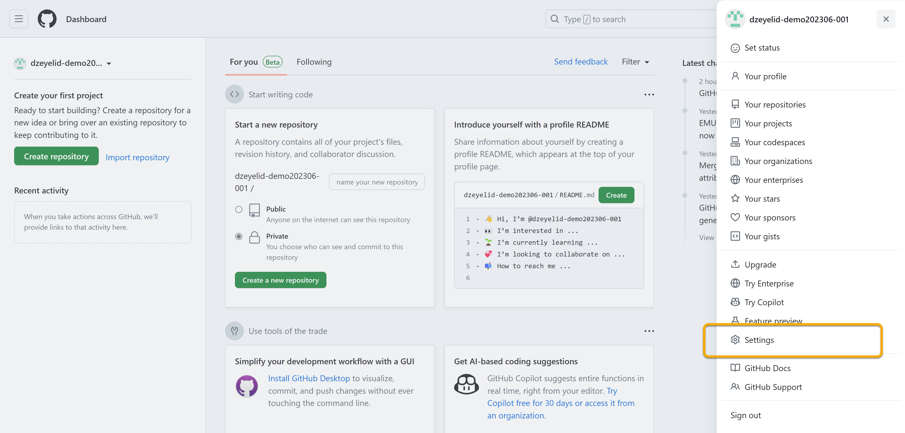
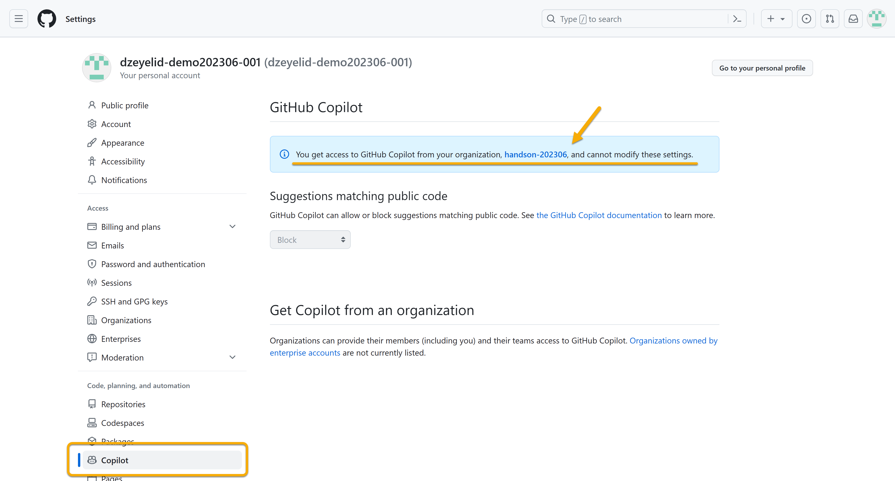
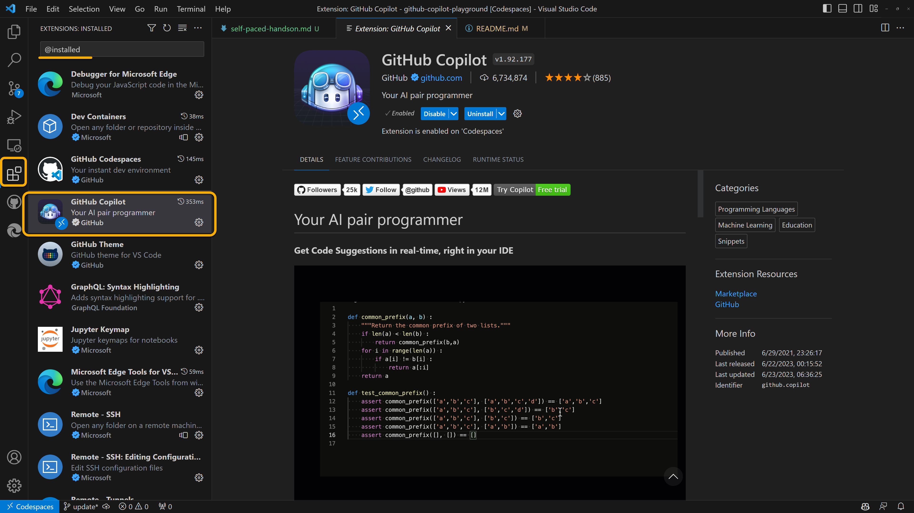
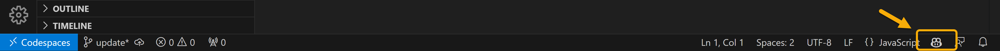
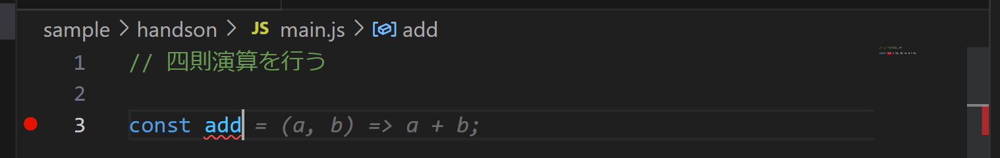
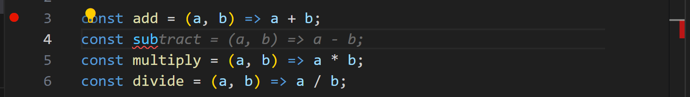
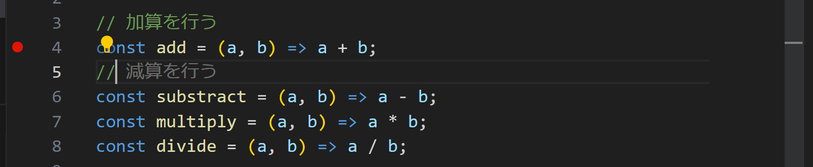
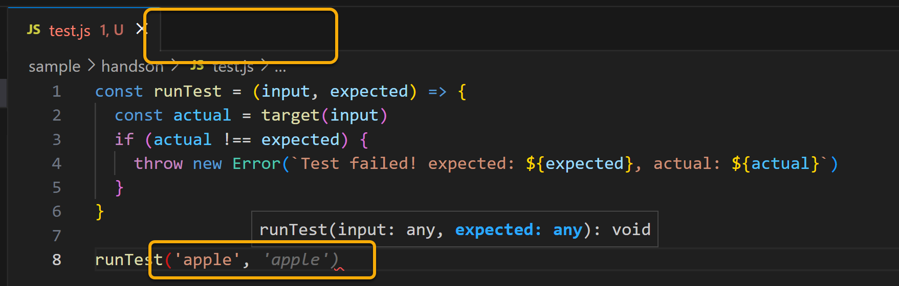
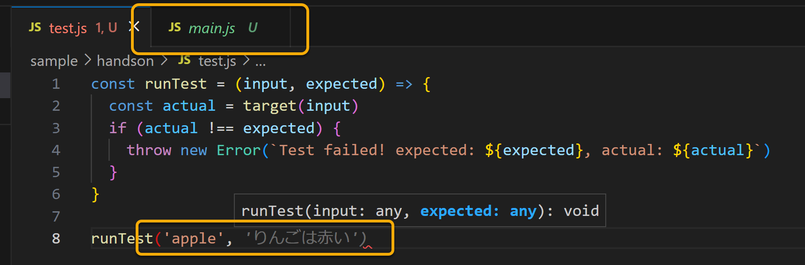
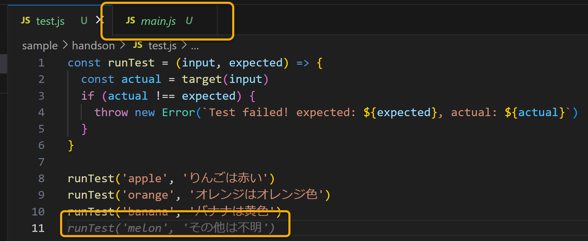

# セルフペースド ハンズオン資料

GitHub Copilotによる、開発に特化した入力補完を体験してみましょう！

## 環境を確認する

まず、GitHub Copilotを利用するために必要な環境を確認します。本ハンズオンでは既に設定済みです。

### GitHub Copilotのライセンスを確認する

GitHub Copilotを利用するにはまず、個人向けの場合は「for Individuals」の契約を、業務向けには「for Business」のライセンスを割り当てる必要があります。

本ハンズオンでは、端末でサインイン済みの各アカウントに対して「for Business」のライセンスを割り当てており、GitHubアカウントの設定から確認することができます。






### エディタの拡張機能を確認する

GitHub Copilotを利用するには、サポートされたエディタ・IDEに拡張機能をインストールする必要があります。

本ハンズオンでは、Visual Studio Codeで準備をしています。拡張機能の画面で、「GitHub Copilot」の拡張機能がインストール済みであることが確認できます。



また、コードを書いている間は、右下にGitHub Copilotのアイコンが表示されていることを確認してください。提案を返そうとする間は回転するマークの表示になります。なお、アイコンの背景が暗い黄色の場合はDeactive（無効）になっているので、クリックしてActive（有効）にしてください。



Visual Studio CodeのGitHub Copilot拡張機能については、こちらをご参照ください。

- [GitHub Copilot - Visual Studio Marketplace](https://marketplace.visualstudio.com/items?itemName=GitHub.copilot)

その他のサポートしているエディタ・IDEについては、こちらをご参考ください。

- [Getting started with GitHub Copilot - GitHub Docs](https://docs.github.com/en/copilot/getting-started-with-github-copilot)

## GitHub Copilotと書いてみる

GitHub Copilotは、GPTモデルを利用した「**開発に特化した入力補完**」です。ベースに利用されている[Codex](https://openai.com/blog/openai-codex)はが開発用に調整されたモデルであり、他のGPTモデルに比べて開発作業を邪魔しない速度で応答できる速さが特徴です。

それでは実際にGitHub Copilotを使って、コードを書いてみましょう！

### ゼロから書き出してみる

コメントや関数や変数など名前が提案生成の要素となるので、意識して書いてみましょう。

作業用に、ハンズオンのタイムスケジュールごとにディレクトリを用意しています。もしくは、任意のディレクトリを作成し作業を進めてください。

- 13:00開始 → `C:\projects\handson-1300`
- 15:00開始 → `C:\projects\handson-1500`

`main.js`ファイルを作成し、以下のようなコードを書いてみます。GitHub Copilotの動きを体験できるように、コピー＆ペーストではなく、入力してみてください。

```js
// 四則演算を行う

const add
```

ちょうど書き終わるころ、下図のように`const add`の後ろに候補が表示されるのがわかりますか？



これがGitHub Copilotによる候補です。確定するには、「Tab」キーを入力してください。却下（無視）するには「Esc」キーでクリアできます。

また、候補がいくつかある場合はオンカーソルで選択ウィンドウが表示されるのでそれを操作するか、キーボードショートカットでも候補の切り替えが可能です。


| OS | 	次の候補を表示 | 前の候補を表示 |
|----|----|----|
| Windows, Linux | `Alt` + `]` | `Alt` + `[` |
| macOS | `Option` + `]` | `Option` + `[` |

この調子で、四則演算ができる4つの関数を書いてみましょう。だいたい以下のようになりましたか？

処理の細部が異なっていても問題ありません。実際のコーディングでは、候補が意図したものか、よくレビューして採用/却下を繰り返して書き進めます。

```js
// 四則演算を行う

const add = (a, b) => a + b;
const sub = (a, b) => a - b;
const mul = (a, b) => a * b;
const div = (a, b) => a / b;
```

ここで、もう少し手直しをしていきましょう。`mul`や`div`はわかりにくいので、`multiply`と`divide`に変更します。

```js
// 四則演算を行う

const add = (a, b) => a + b;
const sub = (a, b) => a - b;
const multiply = (a, b) => a * b;
const divide = (a, b) => a / b;
```

そして、`sub`も略称から変更したいのですが、手で入力するのは面倒なので、GitHub Copilotさせましょう。`const sub`の行の`b`から後ろ（`b = (a, b) => a - b;`）を削除して、再度`b`を入力してみてください。

すると、`sub`ではなく`substract`が提案されたかと思います。



このように、編集しているカーソルの位置の上方の文脈だけでなく、下方の文脈も考慮して提案が生成されていることがわかります。これは、FIM（Fill-in-the-Middle）という手法が採用されているためです。

また、各行にコメントを挿入していく作業なども、GitHub Copilotの提案がとても便利です。



それから、コードだけでなくドキュメンテーションでもGitHub Copilotは便利です。`README.md`ファイルを作成して、以下のような内容を書きすすめてみましょう。

```md
# 動物の種類を返却する関数群

このディレクトリには、動物の種類を返却する関数群が格納されています。

- 犬
- 猫
- うさぎ
- ハムスター
- 爬虫類
```

冒頭ではあまり適した提案がされませんが、書き進めるにつれて内容に即した提案がされるようになるのがわかるかと思います。

### タブで開いたファイルもコンテキストに含まれる

さて、実際の開発では1つのファイルで収まることはありません。既存の処理を考慮した上で書き進めたい場合が大半です。

そのときは、文脈を読ませたいファイルをタブで開いておけばよいのです。

試してみましょう。

まず、さきほどの`main.js`を以下に書き換えて、一度閉じます。（これはコピー&ペーストで構いません）

```js
// 指定されたフルーツの説明を返却する
module.exports = function (fruit) {
  switch (fruit) {
    case 'apple':
      return 'りんごは赤い';
    case 'orange':
      return 'オレンジはオレンジ色';
    case 'banana':
      return 'バナナは黄色';
    default:
      return 'その他は不明';
  }
}
```

つぎに、テストを書く想定で`test.js`を作成し、下記を記入します。（これもコピー&ペーストで構いません）

```js
const runTest = (input, expected) => {
  const actual = target(input)
  if (actual !== expected) {
    throw new Error(`Test failed! expected: ${expected}, actual: ${actual}`)
  }
}
```

他にタブが開いていないことを確認してから、さらに、`runTest('apple',`と書き進めてみると、特に当たり障りのない提案がされます。



ここで、`main.js`をタブに開いてから、再度`runTest('apple',`と書き進めてみると、`main.js`の内容を読み取った上で、`apple`に対するテストを書くように提案がされるようになります。



そのまま「Tab」で確定していくと、テストの続きが提案され、うまくいけば、その他の場合のテストに対しても適当な`input`が提案されることを確認できるかもしれません。（※これらのコンテンツは、ハンズオン用に明確に候補が出るように調整していますが、実際の開発では内容により確定的に正しい提案がされるわけではありません）



### 編集中のファイルパスや言語が優先される

また、編集中のファイルのパスやファイル名も判断材料となります。

例えば、`main.js`というファイルを編集している場合、GitHub Copilotは「`main.js`というJavaScriptのファイルを編集している」というような情報もコンテキストに含め、隣接するタブがある場合は同じ言語のものを優先して含めるようになっているそうです。

（サンプルは割愛します）

## 自由に触ってみる

さて、ここまでで、GitHub Copilotの基本的な使い方を紹介しました。

GitHub Copilotに関する情報は、公式ドキュメントやブログからもを得ることができます。

- [最初の候補を表示する | GitHub Copilot の概要 - GitHub Docs](https://docs.github.com/ja/copilot/getting-started-with-github-copilot#seeing-your-first-suggestion)
- [GitHub Copilot now has a better AI model and new capabilities | The GitHub Blog](https://github.blog/2023-02-14-github-copilot-now-has-a-better-ai-model-and-new-capabilities/)
- [How to use GitHub Copilot: Prompts, tips, and use cases | The GitHub Blog](https://github.blog/2023-06-20-how-to-write-better-prompts-for-github-copilot/)

残りの時間は自由に体験してみてください！
