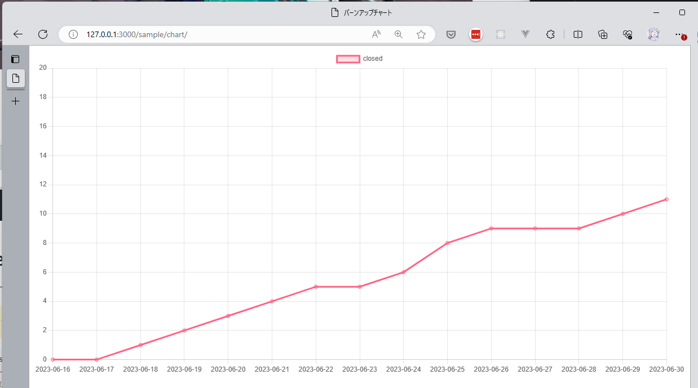

# 追加コンテンツ: 静的サイトをGitHub Pagesにデプロイする

セルフペースドハンズオンの追加コンテンツです。

## 事前準備

このコンテンツは、[セルフペースド ハンズオン（拡大版）](./advanced.md)の[ハンズオンを進めるための準備](./advanced.md#ハンズオンを進めるための準備)が済んでいる前提で進めます。

## 事前知識

このコンテンツでは、以下の要素を利用しています。ハンズオン内では詳しい解説はしませんので、興味のある方は各公式ドキュメントなどをご参照ください。

- [Astro](https://astro.build/)
- [GitHub Actions](https://docs.github.com/ja/actions)
- [GitHub Pages](https://docs.github.com/ja/pages)

## 静的サイトを作る

`sample/chart/app`にAstroの新規プロジェクトを置いているので、ここにバーンダウンチャートを表示させてみましょう。

まずは、`sample/chart/app`に移動して、依存関係をインストールしておきます。

```bash
cd sample/chart/app
npm install
```

`sample/chart/app/src/pages/index.astro`がトップページにあたり、以下のように最低限の記述がされています。ここに処理を追加していきましょう。

```astro
---
---

<html lang="en">
  <head>
    <meta charset="utf-8" />
    <link rel="icon" type="image/svg+xml" href="/favicon.svg" />
    <meta name="viewport" content="width=device-width" />
    <meta name="generator" content={Astro.generator} />
    <title>Astro</title>
  </head>
  <body>
    <h1>Astro</h1>
  </body>
</html>
```

まず、仕様を書き込んでおきましょう。`---`で囲まれた部分は、AstroでPrebuildaされるComponent Scriptを記述するところで、いったんここに書き込みます。（GitHub Copilotに自然言語の指示を読ませるにはどこに書いてもよいのですが、ファイルの冒頭でわかりやすく、また、ビルド後の生成物に反映されないのでここに書きます。）

```js
/**
 * Chart.jsを使ってバーンアップチャートを作成する
 * - 元になるデータ
 *   - 以下のようなJSON形式
 *     ```
 *     [
 *       {
 *         "id": 1,
 *         "title": "Issue 1",
 *         "description": "Issue 1 description",
 *         "status": "todo",
 *         "assignee": "John Doe",
 *         "created": "2023-06-01",
 *         "closed": null
 *       }
 *     ]
 *     ```
 *   - 以下からダウンロードする
 *     - https://raw.githubusercontent.com/dzeyelid/github-copilot-playground/main/sample/chart/issues.json
 * - チャートの期間は、2023/6/16から2023/6/30までとする
 * - y軸
 *   - 最大値はアイテムの個数とする
 *   - 日付におけるclosedの累計の個数を示す
 * - x軸
 *   - 日付を示す  
*/
```

この仕様に沿ってチャートを書き出しましょう。

`<h1>Astro</h1>`の下に`<canvas>`と`<script>`を記述していきます。

まずは、`<canvas>`の配置を促したいので、以下のようなコメントを書き込んで、改行してみましょう。（行頭の`+`は差分表示用の記号のため、コードからは除いてください。）

```diff
  <h1>Astro</h1>
+ <!-- チャートを描画する -->
+ 
```

`<canvas>`を記述したら、その下に`<script>`を記述し、利用する予定のライブラリも読み込みます。後述のコードをコピーして貼り付けてください。（※ 通常のHTML中の`<script>`では、`import`することはありませんが、Astroの仕組み上利用できます。ただし、Astroは比較的新しいフレームワークのためか、提案が甘いこともあるため、ここでは記述してしまいます。）

```diff
  <h1>Astro</h1>
  <!-- チャートを描画する -->
  <canvas id="chart"></canvas>
+ <script>
+   import Chart from 'chart.js/auto'
+ 
+   …略…
+ 
+   // データを取得する
```

コピーする際はこちらのコードをご利用ください。

```html
<script>
  import Chart from 'chart.js/auto'
  import { add, compareAsc, format, isSameDay } from 'date-fns'

  // データを取得する
</script>
```

`// データを取得する`のあとから、GitHub Copilotと対話を進めていきましょう。以下のような記述になるとよいです。

```js
// データを取得する
const response = await fetch('https://raw.githubusercontent.com/dzeyelid/github-copilot-playground/main/sample/chart/issues.json')
const data = await response.json()

// チャートの期間を設定する
const start = new Date('2023-06-16')
const end = new Date('2023-06-30')

```

次に、期間中のclosedが指定されているissueの日毎の累計を算出します。以下のようにデータの構造を示しておくと、提案を制御しやすいです。

```js
// 期間中、日毎に、開始時点からその日までのclosedの累計を算出する
// {
//    date: string,
//    count: number
// }
```

日毎のclosedの累計を抽出できたら、バーンダウンチャートを描画します。以下のように記述してみましょう。

```js
// バーンアップチャートを描画する
```

`Chart`のインスタンスを生成するコードが提案されると思います。ポイントは、第二引数に渡すオブジェクトで、`data.labels`に上記の`date`を抽出した配列を、`data.datasets.[].data`に上記の`count`を抽出した配列を渡します。

コードが書けたら、実行してみましょう。

ローカルで動かせるように、`sample/chart/app/astro.config.mjs`の`defineConfig`に渡す`site`と`base`をコメントアウトしてください。

```js
export default defineConfig({
  // site: 'https://dzeyelid.github.io'
  // base: 'github-copilot-playground'
});
```

つぎに、先ほど移動したディレクトリ`sample/chart/app`で、以下のコマンドを実行します。

```bash
npm run dev -- --host 0.0.0.0
```

`http://localhost:3000`にアクセスすると、以下のようなバーンアップチャートが表示されたら成功です。



## GitHub Pagesにデプロイする

`sample/chart/app/astro.config.mjs`の`defineConfig`に渡す`site`と`base`をご自身の環境に合わせて更新してください。

```js
export default defineConfig({
  site: 'https://dzeyelid.github.io'
  base: 'github-copilot-playground'
});
```

```yml
# GitHub Actionsでsample/chart/appのAstroのアプリケーションをGitHub Pagesにデプロイする
# - 契機は、以下の通り
#   - mainブランチにプッシュされたとき
#   - 手動で実行したとき
# - 使用するアクションは、以下の通り
#   - actions/checkout@v3
#   - actions/configure-pages@v3
#   - actions/upload-pages-artifact@v1
#   - actions/deploy-pages@v2
# - 手順
#   - Astroのアプリケーションのビルドを行う
#   - ビルドしたAstroのアプリケーションをGitHub Pages用にアップロードする
#   - アップロードされたアプリケーションをGitHub Pagesにデプロイする
```

```yml
  jobs:
    deploy:
      runs-on: ubuntu-latest
+     # 作業ディレクトリを指定する
```

```yml
    steps:
      - name: Checkout
        uses: actions/checkout@v3

      - name: Build
        run: npm run build

      # GitHub Pagesをセットアップする
```